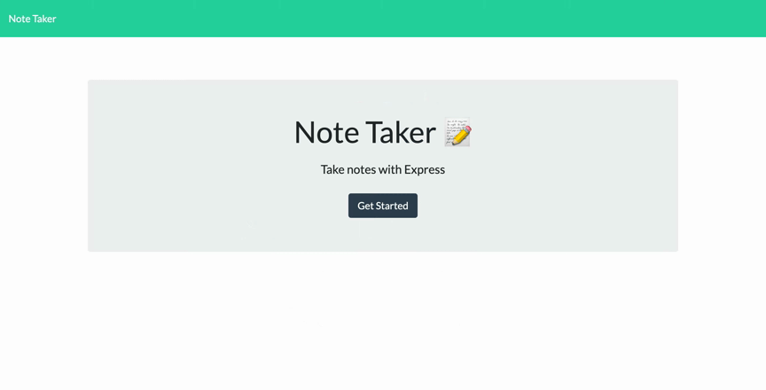

# expressjsnotetakerhw11
<br>

  [](https://opensource.org/licenses/MIT) 
  <br>

  # Table of Contents
  - [Description](#Description)
  - [Installation](#Installation)
  - [Usage](#Usage)
  - [Contributing](#Contributing)
  - [License and Copyright](#License-and-Copyright)
  - [Citations](#Citations)
  - [Questions](#Questions)
  
  # Description
  
The note taker is an application built in node JS heavily relying on express to create a application that allows the user to store and delete notes on a webpage.<br>
   <br>
  
  # Installation
  
  In order to install this application, the user will need to download associated files, and be sure to install nodeJS on their machine.  Next the user will need to navigate to the directory in their terminal and run the command ```npm i``` to install the correct nodeJS packages.  Following that, the user will need to run command ```npm i express``` in the terminal in order to install express, as well as ```npm i nanoid``` to install nanoid, which is needed to generate unique ids for the notes.  The user would then need to deploy either via localhost or a hosting service as appropriate.<br>
  
  # Usage
  
  After navigating to the starting page the user will click the get started button and then is taken to the note taker page.  If any notes already exist they will be displayed to the left and can be accessed to read or deleted.  There a plus button to generate a new note in the main frame where the user can start typing if they wish to add a new note, once there is text in the note the user has the option to save the note. <br>
   <br>
 
  
  # Contributing
  
  Please reach out via the links in the contact section about contributing<br>
  
  # Tests
  
  please reach out via the contact links regarding testing <br>
  
  # License and Copyright
  
  Copyright 2021 Ian Hennessey
  
  <br>

  
      Permission is hereby granted, free of charge, to any person obtaining a copy of this software and associated documentation files (the "Software"), to deal in the Software without restriction, including without limitation the rights to use, copy, modify, merge, publish, distribute, sublicense, and/or sell copies of the Software, and to permit persons to whom the Software is furnished to do so, subject to the following conditions:
      
      The above copyright notice and this permission notice shall be included in all copies or substantial portions of the Software.
      
      THE SOFTWARE IS PROVIDED "AS IS", WITHOUT WARRANTY OF ANY KIND, EXPRESS OR IMPLIED, INCLUDING BUT NOT LIMITED TO THE WARRANTIES OF MERCHANTABILITY, FITNESS FOR A PARTICULAR PURPOSE AND NONINFRINGEMENT. IN NO EVENT SHALL THE AUTHORS OR COPYRIGHT HOLDERS BE LIABLE FOR ANY CLAIM, DAMAGES OR OTHER LIABILITY, WHETHER IN AN ACTION OF CONTRACT, TORT OR OTHERWISE, ARISING FROM, OUT OF OR IN CONNECTION WITH THE SOFTWARE OR THE USE OR OTHER DEALINGS IN THE SOFTWARE.
      

  <br>

  [License: The MIT License](<https://opensource.org/licenses/MIT>)

  <br>

  # Citations

  nanoid <br>
  nodeJS <br>
  express <br>
  
  # Questions?
  Please reach out to Ian Hennessey using the contact options below: <br>
  [GitHub Profile](<https://github.com/atleastitsanethosman>)<br>
  [Email](<mailto:ian.hennessey@gmail.com>)
  
